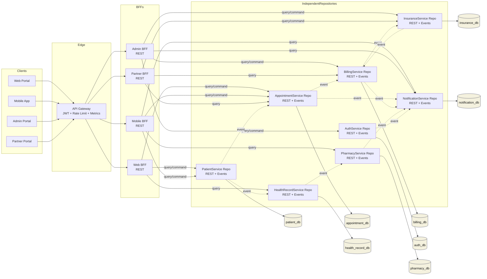

# Architecture Overview

## Structural Decisions

- Every business capability is implemented as an independent Spring Boot service.
- Every service owns a dedicated MySQL schema and does not share tables with any other service.
- External client traffic enters through a dedicated Spring Cloud API Gateway.
- REST is used for synchronous queries and commands where immediate responses are required.
- Asynchronous messaging is used for decoupled event propagation between services.
- Four BFFs are introduced to tailor service aggregation to web, mobile, admin, and partner client needs.

## API Gateway Capabilities

Detailed guide: `docs/api-gateway.md`

- Gateway module: `gateway/api-gateway` (Spring Cloud Gateway).
- JWT authentication: `auth-service` issues HS256 JWTs through `POST /api/v1/auth/login`; gateway validates tokens.
- Authorization:
    - route-level authorization at gateway
    - method-level authorization in BFF endpoints for defense in depth
- BFF token relay: BFF clients forward inbound `Authorization` and `X-Correlation-Id` headers to downstream services.
- Downstream authorization: `billing-service` and `insurance-service` enforce JWT resource-server validation plus role-based access rules.
- Rate limiting: Redis-backed request limits keyed by authenticated token subject.
- Logging: gateway emits access-style request logs and propagates `X-Correlation-Id`.
- Metrics: gateway and secured BFFs expose actuator metrics/prometheus endpoints.
- Caching strategy: short-lived cache headers on selected GET read endpoints (`dashboard`, `mobile-overview`).

## Collaboration Summary

| Service | Main Responsibility | Typical Sync APIs | Typical Async Events |
| --- | --- | --- | --- |
| PatientService | patient profile lifecycle | create patient, get patient, update patient, search patients | `PatientRegistered`, `PatientUpdated` |
| AppointmentService | appointment scheduling lifecycle | book appointment, get appointment, reschedule appointment, cancel appointment | `AppointmentBooked`, `AppointmentRescheduled`, `AppointmentCancelled` |
| HealthRecordService | clinical record management | create record, get record, list records by patient | `HealthRecordCreated`, `HealthRecordUpdated` |
| BillingService | invoice and payment lifecycle | create invoice, get invoice, record payment | `InvoiceIssued`, `PaymentRecorded` |
| AuthService | access and identity metadata | register user, get user, assign role | `UserRegistered`, `RoleAssigned` |
| PharmacyService | prescription fulfillment tracking | create prescription, get prescription, dispense medication | `PrescriptionCreated`, `MedicationDispensed` |
| InsuranceService | policy and claim lifecycle | create policy, get policy, submit claim, get claim | `PolicyCreated`, `ClaimSubmitted`, `ClaimProcessed` |
| NotificationService | outbound notification delivery | create notification, get notification status | `NotificationQueued`, `NotificationDelivered`, `NotificationFailed` |

## CQRS And Saga Notes

- `PatientService`, `AppointmentService`, `BillingService`, and `NotificationService` use a CQRS-oriented split between command and query services.
- `AppointmentService -> BillingService -> NotificationService` is implemented as an event-driven workflow using RabbitMQ topics and queues.
- `BillingService` command side consumes `appointment.booked` and issues invoices asynchronously; query side serves invoice lookups.
- `NotificationService` command side consumes domain events and materializes notification records; query side serves notification lookups.

## OpenAPI

Every service and BFF includes Springdoc and exposes:

- `/v3/api-docs`
- `/swagger-ui.html`

Gateway also exposes an aggregated Swagger UI at:

- `/swagger-ui.html`

Gateway Swagger includes direct entries for:

- `api-gateway`
- `auth-service`
- `web-bff`
- `mobile-bff`
- `admin-bff`
- `partner-bff`
- `patient-service`
- `appointment-service`
- `health-record-service`
- `billing-service`
- `pharmacy-service`
- `insurance-service`
- `notification-service`

## Mermaid Diagram

